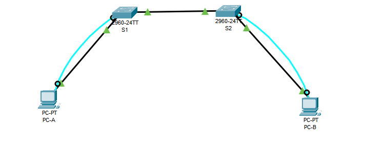

# Топология

 

## Таблица адресации

| Устройство | Интерфейс | IP-адрес     | Маска подсети   |
|------------|-----------|--------------|-----------------|
| S1         | VLAN 1    | 192.168.1.11 | 255.255.255.0   |
| S2         | VLAN 1    | 192.168.1.12 | 255.255.255.0   |
| PC-A       | NIC       | 192.168.1.1  | 255.255.255.0   |
| PC-B       | NIC       | 192.168.1.2  | 255.255.255.0   |

## Часть 1. Создание и настройка сети

- Настройте имена устройств в соответствии с топологией.
    ```
    Switch(config)#hostname S1
    Switch(config)#hostname S2
    PC-A
    PC-B
    ```

- Настройте IP-адреса, как указано в таблице адресации.
    ```
    S1(config)#interface vlan 1
    S1(config-if)#ip address 192.168.1.11 255.255.255.0
    S1(config-if)#no shutdown

    S2(config)#interface vlan 1
    S2(config-if)#ip address 192.168.1.12 255.255.255.0
    S2(config-if)#no shutdown
    ```

- Назначьте `cisco` в качестве паролей консоли и VTY.
    ```
    S1(config)#line console 0
    S1(config-line)#password cisco

    S1(config)#line vty 0 4
    S1(config-line)#password cisco

    S2(config)#line console 0
    S2(config-line)#password cisco

    S2(config)#line vty 0 4
    S2(config-line)#password cisco
    ```

- Назначьте `class` в качестве пароля доступа к привилегированному режиму EXEC.
    ```
    S1(config)#enable secret class
    S2(config)#enable secret class
    ```

## Часть 2. Изучение таблицы MAC-адресов коммутатора

- Запишите MAC-адреса сетевых устройств.
    - MAC-адрес компьютера PC-A: `00D0.D3E9.1E77`
    - MAC-адрес компьютера PC-B: `0090.210E.30C0`
    - MAC-адрес коммутатора S1 Fast Ethernet 0/1: `0001.96e6.6c01`
    - MAC-адрес коммутатора S2 Fast Ethernet 0/1: `00e0.f9ab.9301`

- Просмотрите таблицу MAC-адресов коммутатора. Записан ли в таблице MAC-адрес коммутатора? **Да, MAC-адрес коммутатора записан.**

- Очистите таблицу MAC-адресов коммутатора S2 и снова отобразите таблицу MAC-адресов. Указаны ли в таблице MAC-адресов адреса для VLAN 1? **Нет.** Указаны ли другие MAC-адреса? **Нет.**

Через 10 секунд введите команду `show mac address-table` и нажмите клавишу Enter. Появились ли в таблице МАС-адресов новые адреса?
- Да, появились.

- С компьютера PC-B отправьте эхо-запросы устройствам в сети и просмотрите таблицу МАС-адресов коммутатора.

```plaintext
Vlan    Mac Address       Type        Ports
----    -----------       --------    -----

   1    0001.96e6.6c01    DYNAMIC     Fa0/1
   1    0090.210e.30c0    DYNAMIC     Fa0/18
   1    00d0.d3e9.1e77    DYNAMIC     Fa0/1
   1    00e0.f96c.eedb    DYNAMIC     Fa0/1
```

 - На компьютере PC-B откройте командную строку и еще раз введите команду arp -a.
```
   C:\>arp -a
  Internet Address      Physical Address      Type
  192.168.1.1           00d0.d3e9.1e77        dynamic
  192.168.1.11          00e0.f96c.eedb        dynamic
  192.168.1.12          0060.3ea2.eb13        dynamic
```

 - Появились ли в ARP-кэше компьютера PC-B дополнительные записи для всех сетевых устройств, которым были отправлены эхо-запросы? - Да, появились.


